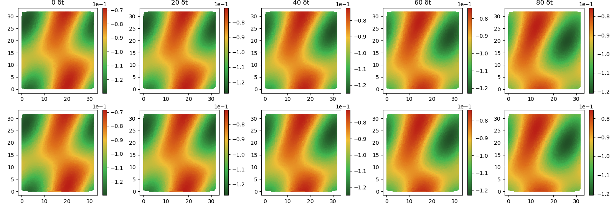
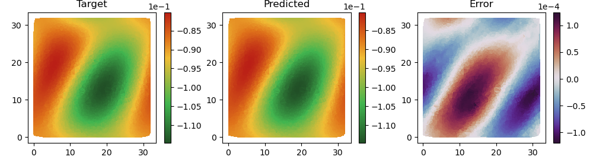

# TaylorPDENet

## Theory

In this repository the code for the *TaylorPDENet* can be found. It is based on the estimation of the derivatives contained in the PDE (Partial Differential Equation) with the Taylor Polyinomial.

$$
P_n(x,y) = \sum_{q=0}^Q \sum_{r=0}^{Q-j} \frac{(x-x_0)^j(y-y_0)^k }{q!r!} \cdot \frac{\partial^{(q+r)}f}{\partial x^q \partial y^r}(x_0,y_0)
$$

The Taylor polyinomial can be rewritten to form a system of linear equations cotaining the derivatives $d_{(q,r)}$ as unknowns.

$$
f(x_i, y_i)-f(x_0, y_0) = \sum_{q+r\leq Q; q,r\geq 0}\alpha^{(i)}(q, r)d_{(q,r)}
$$

Where the $\alpha(q, r)$ are the known coefficients computed by the $x$ and $y$ distance to the point $(x_0, y_0)$, and $f(x,y)-f(x_0,y_0)$ are the differences of the values at the points.

$$
\Delta \mathbf{u} = \mathbf{A}\mathbf{D}
$$

The single derivatives can then be computed solving the above mentioned linear system of euations for several points $P_i$.

The *TaylorPDENet* is able to perfrom symbolic regression and find the coefficients of the underlying advection-diffusion equation and perform prediction of future states of the dynamic system.

<div  align="center">

</div>

<div  align="center">

</div>

---
## Setup
Install the ```requirements.txt``` file. We use the [pytorch lightning](https://lightning.ai/docs/pytorch/stable/) framework for training and testing purposes.

Generate data with ```pde-generator```

### Basic Usage pde-generator
- clone repository
- Install `requirements.txt` in pde-generator
- run `mkdir data` in TaylorPDENet

The following command generates a PDE of the second order and a starting seed (42).

- Run twice with different seeds (one for training and one for testing).
- For training data use `--seed 42 --save-name 'example_256'`
- For testing data use  `--seed 31 --save-name 'example_256_test'`

```
python3 main.py \
--t_max 256 \
--grid-size 256 \
--save-dt 0.5 \
--step-size 0.001 \
from_string \
--equation "1.5*u_x_1_y_0^1+1.65*u_x_0_y_1^1+0.55*u_x_2_y_0^1+0.7*u_x_0_y_2^1+1.0*u_y_1_x_1^1" \
--seed 42 \
--save-name 'example_256'
```

---
## Usage
For training execute
```bash
python3 main.py
```
with
```
--net -> 'TP_net' (ours)
--equation -> your equation e.g. 'example_256'
--epochs -> number of epochs
--neighbors -> number of neighbors
--gridsize -> number of points on one side; If downsampled overall number of points will be (gridsize * gridsize)
--sample -> Downsample?
--forecast -> number of dt-Blocks
--order -> order of PDE (recommended 2)
--dt -> timestep
--test_forecast -> number of dt-Blocks for testing
```

Example:

```python3 main.py --net 'TP_net' --equation 'example_256' --sample True```

In the background pytorch lightning will train the model and finally test the the model after the indicated number of training-epochs. In the end the coefficients are printed in the console.
